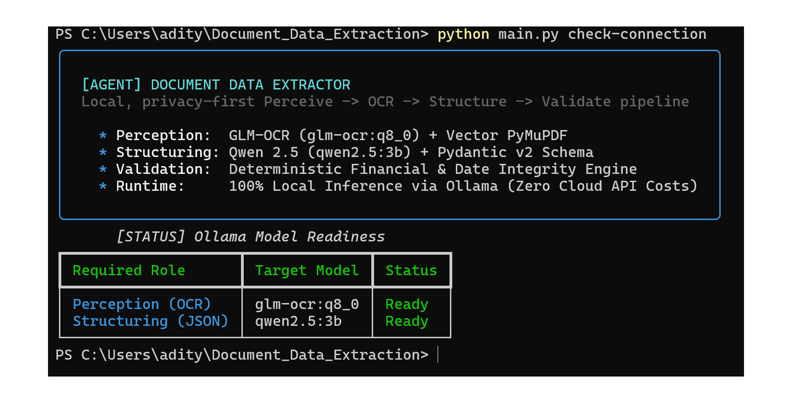
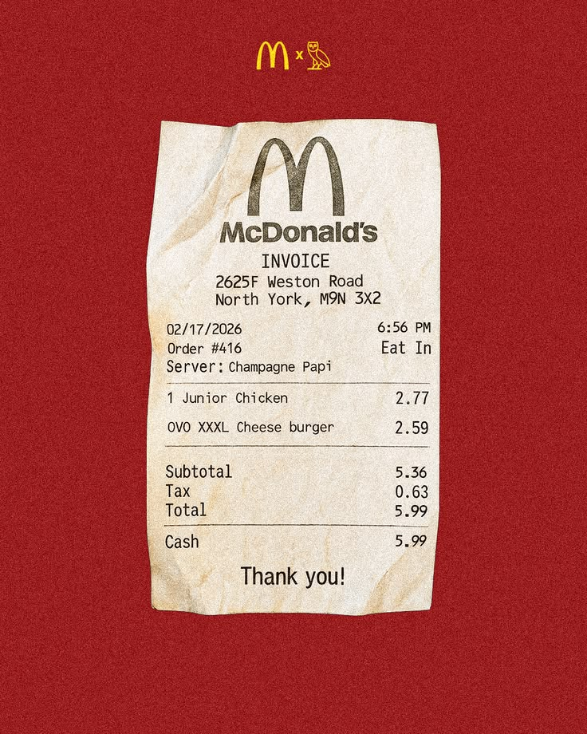
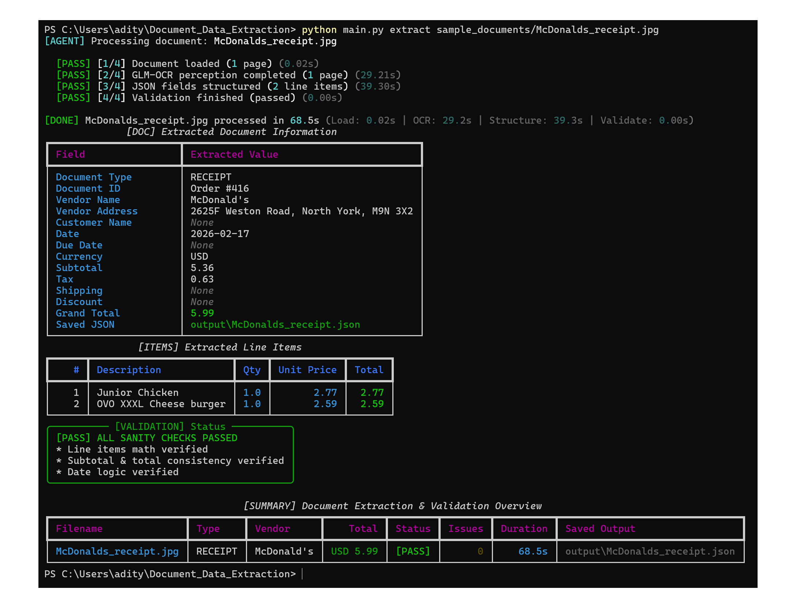
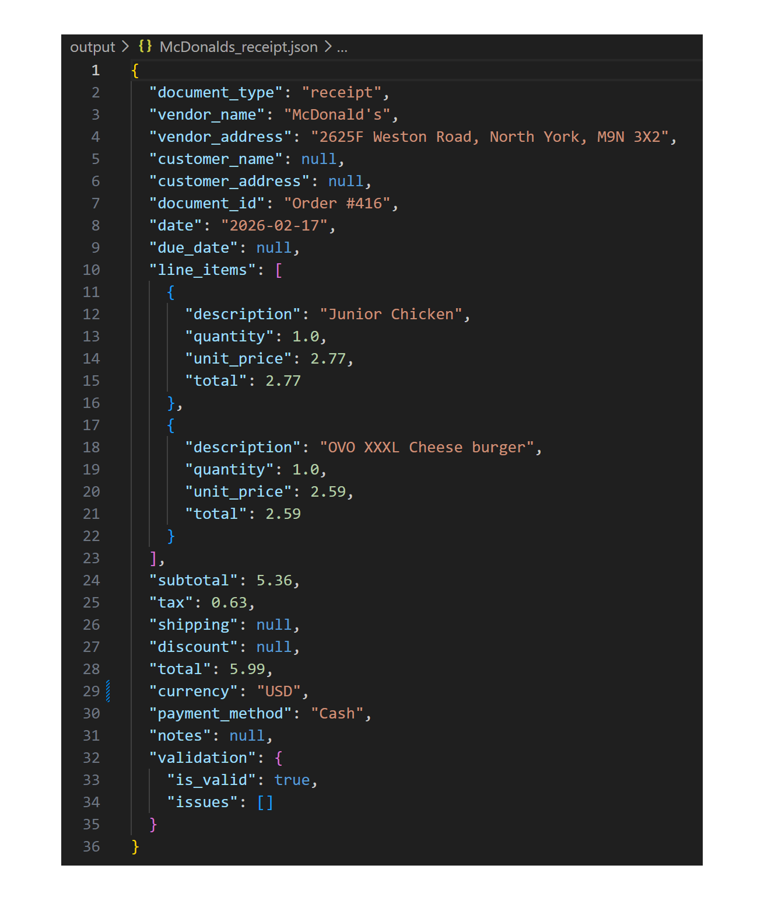
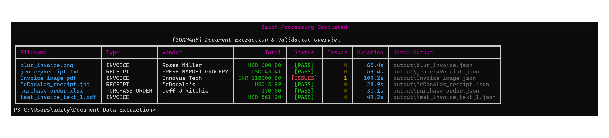
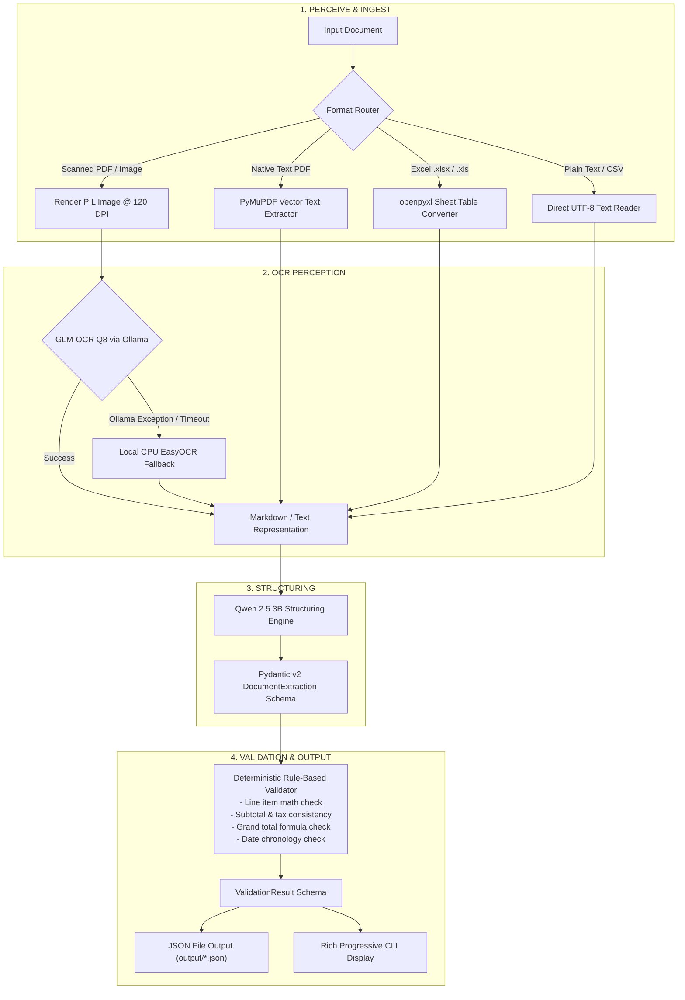

# Document Data Extractor Agent

> An intelligent, privacy-first **Perceive -> OCR -> Structure -> Validate** pipeline that extracts structured JSON from invoices, receipts, and purchase orders using local Ollama models with deterministic rule-based validation (zero cloud API dependencies).

### Supported Document Formats
- **PDFs (`.pdf`)**: Native text or scanned documents.
- **Images (`.png`, `.jpg`, `.jpeg`, `.webp`, `.bmp`, `.tiff`)**: Receipts and document scans processed with OCR.
- **Spreadsheets (`.xlsx`, `.xls`, `.xlsm`)**: Workbooks converted to Markdown tables.
- **Text files (`.txt`, `.csv`, `.tsv`, `.md`, `.json`, `.log`)**: Plain and structured text documents.

---

## Table of Contents
- [Installation & Quick Setup](#installation--quick-setup)
  - [Quick Setup (1-Click Automated Launchers)](#quick-setup-1-click-automated-launchers)
  - [Step-by-Step Setup](#step-by-step-setup)
  - [System Requirements](#system-requirements)
- [Usage & 30-Second Review](#usage--30-second-review)
  - [End-to-End Walkthrough (Prompt to Final Output)](#end-to-end-walkthrough-prompt-to-final-output)
  - [Inlined Worked Example: Invoice_image.pdf](#inlined-worked-example-invoice_imagepdf)
  - [Multi-Document Results Table (All 6 Sample Files)](#multi-document-results-table-all-6-sample-files)
  - [CLI Command Reference](#cli-command-reference)
- [Architecture](#architecture)
- [Design Decisions & Tradeoffs](#design-decisions--tradeoffs)
- [Testing](#testing)
- [Limitations & Known Failure Cases](#limitations--known-failure-cases)
- [Future Improvements](#future-improvements)
- [Repository Structure](#repository-structure)

---

## Installation & Quick Setup

### Quick Setup (1-Click Automated Launchers)
Automated scripts pull the required models, install Python packages, and process all sample documents in a single command:
- **Windows**: Double-click or run [`run.bat`](run.bat)
- **Linux / macOS**: Run `bash run.sh`

---

### Step-by-Step Setup

If you prefer to configure each step manually:

1. **Verify Ollama is Installed and Running**:
   ```bash
   ollama --version
   ```
   *(If not installed, download the desktop application from [ollama.com](https://ollama.com) and start it).*

2. **Pull the Required Quantized Models**:
   ```bash
   ollama pull glm-ocr:q8_0
   ollama pull qwen2.5:3b
   ```

3. **Install Python Dependencies**:
   ```bash
   pip install -r requirements.txt
   ```

4. **Verify Environment Connection**:
   ```bash
   python main.py check-connection
   ```

---

### System Requirements

- **Operating System**: Windows 10/11, macOS, or Linux.
- **Python Version**: Python 3.10+ (tested on Python 3.11.5).
- **Ollama Engine**: Local Ollama server running at `http://localhost:11434`.
- **Local Model Weights**:
  - `glm-ocr:q8_0` (1.6 GB disk space)
  - `qwen2.5:3b` (1.9 GB disk space)
  - *Total model storage footprint*: ~3.5 GB.
- **Hardware**: 8 GB RAM minimum (runs comfortably on CPU). GPU acceleration is supported if available but not required.
- **Privacy**: 100% local execution — zero external API keys, zero cloud transmission, zero per-page fees.

---

## Usage & 30-Second Review

This section walks you step-by-step through a complete run: from launching a command in the terminal to inspecting the progressive checklist, terminal tables, and saved JSON payload.

### End-to-End Walkthrough (Prompt to Final Output)

#### Step 1: Check Model Readiness
Run `python main.py check-connection` to verify that Ollama is active and both models are loaded.


#### Step 2: Execute Extraction with Live Progressive Checklist
Run extraction on a single document:
#### The Document - McDonald's Receipt

```bash
python main.py extract sample_documents/Invoice_image.pdf
```

While computing, the terminal displays an active spinner with real-time timers. As each stage finishes, it freezes into a permanent checklist line:


#### Step 3: Terminal Display (Fields, Line Items & Validation Panel)
The agent prints formatted tables for instant human inspection:


---

### Inlined Worked Example: `Invoice_image.pdf`

Below is the verbatim JSON output written to [`output/McDonalds_receipt.json`](output/McDonalds_receipt.json):




---

### Multi-Document Results Table (All 6 Sample Files)

Run `python main.py extract-all` to process every sample document in [`sample_documents/`](sample_documents/) and generate the summary table:



- Raw JSON outputs are available in the [`output/`](output/) folder.
- Full documentation on error isolation and failure cases: [`docs/validation_and_failures.md`](docs/validation_and_failures.md)

<!-- TODO: screenshot of final batch summary table, insert here -->

---

### CLI Command Reference

```bash
# Display help and command usage
python main.py -h

# Check local Ollama connection and model readiness
python main.py check-connection

# Extract and validate a single document
python main.py extract sample_documents/purchase_order.xlsx

# Batch extract all documents in sample_documents/
python main.py extract-all

# Specify a custom output directory
python main.py extract sample_documents/receipt.jpg --output-dir my_extractions/

# Format and view saved output JSON directly in terminal
python -m json.tool output/purchase_order.json
```

---

## Architecture



---

## Design Decisions & Tradeoffs

1. **Two-Stage Pipeline (`glm-ocr:q8_0` + `qwen2.5:3b`)**:
   - `glm-ocr:q8_0` handles image-based text and layout extraction. `qwen2.5:3b` is used as a general-purpose text model to map the OCR output to the extraction schema as JSON.
   - Separating these stages keeps the models compact enough for commodity CPU hardware (~3.5 GB of model weights).

2. **Explicit Context Window Configuration (`num_ctx: 10240`)**:
   - [`src/ocr_client.py`](src/ocr_client.py) sets `num_ctx` to `10240` to reduce truncation on dense, full-page invoices.

3. **Best-Effort EasyOCR Fallback**:
   - If the Ollama OCR request fails or returns no text, [`src/ocr_client.py`](src/ocr_client.py) attempts local CPU-based EasyOCR.

4. **Excel Spreadsheet Ingestion (`openpyxl`)**:
   - [`src/document_loader.py`](src/document_loader.py) converts non-empty worksheet rows into compact Markdown, reducing prompt size for sparse templates.

5. **Deterministic Rule-Based Validation**:
   - [`src/validator.py`](src/validator.py) performs financial arithmetic, tax, and date checks in pure Python for reproducible results.

6. **Null-Safe Line Item Arithmetic**:
   - Quantity $\times$ unit-price checks run only when both values are present, avoiding false positives on receipts that provide only an item total.

---

## Testing

The test suite covers document loading for PDF, image, Excel, and text files; OCR text preprocessing; financial arithmetic; discount and shipping calculations; date validation; and null-safe receipt line items.

### Running Unit Tests

```bash
# Run from the repository root
python -m pytest tests/
```

The current suite contains 8 tests. Runtime and detailed output may vary by environment.

### Example Output

```text
============================= test session starts =============================
collected 8 items

tests\test_pipeline.py ........                                          [100%]

============================== 8 passed in 1.40s ==============================
```

---

## Limitations & Known Failure Cases

1. **Small Structuring Model Capacity (`qwen2.5:3b`)**:
   - `qwen2.5:3b` is optimized for speed and low memory footprint on local hardware. While `glm-ocr` reliably transcribes complex visual layouts, the 3B model can occasionally miss fields or drop secondary table rows on highly unconventional layouts.
2. **Multi-Table Invoice Boundaries**:
   - If an invoice has separate tables, such as materials and labor, the structuring stage may combine all items into one list.
3. **Limited Tax Breakdown Representation**:
   - The schema stores tax as one value, so detailed GST components such as CGST and SGST cannot be represented or explained separately.
4. **Execution Throughput on CPU**:
   - Single-threaded local inference on CPU takes between **24s and 108s per document** (totaling ~6.3 minutes for the 6 sample documents). Processing a batch of 50 documents on CPU would take approximately 45–60 minutes.
5. **Language and Quality Constraints**:
   - `glm-ocr` is optimized for English and Chinese printed text; handwritten annotations and degraded low-DPI scans can cause optical character confusion.
   - For full analysis of error handling, see [`docs/validation_and_failures.md`](docs/validation_and_failures.md).

---

## Future Improvements

> *Note: The items below are not currently implemented and are documented as scoped future architectural enhancements.*

- **Image Preprocessing**:
  - Add deskewing, denoising, contrast enhancement, orientation detection, and adaptive resizing before OCR to improve results on photographed or degraded documents.
- **Pipelined / Overlapped Asynchronous Execution**:
  - Because `glm-ocr:q8_0` (1.6 GB) and `qwen2.5:3b` (1.9 GB) fit concurrently within system memory, the agent could overlap execution by running OCR on document $N+1$ while structuring document $N$.
- **Confidence Scores and Field Provenance**:
  - Record confidence scores, source pages, and optionally the supporting OCR text for each extracted field.
- **Human Review Workflow**:
  - Allow users to review and correct low-confidence fields or validation failures before exporting results.
- **Multi-Tax Component Schema Extension**:
  - Extend the scalar `tax: float` field to a structured `taxes: list[TaxComponent]` model for components such as CGST, SGST, VAT, state tax, and federal tax.
- **Dynamic Few-Shot Prompt Routing**:
  - Inject layout examples into the structuring prompt based on the detected document domain, such as hospitality, logistics, or retail.

---

## Repository Structure

```
Document_Data_Extraction/
├── README.md                          # Project documentation & 30-second review
├── requirements.txt                   # Production dependencies
├── main.py                            # CLI entry point (extract, extract-all, check-connection)
├── run.bat                            # 1-click Windows runner
├── run.sh                             # 1-click Linux/macOS runner
├── docs/
│   └── validation_and_failures.md     # In-depth validation rules & failure case analysis
├── src/
│   ├── __init__.py
│   ├── agent.py                       # Pipeline orchestrator & stage latency telemetry
│   ├── document_loader.py             # Multi-format ingestion (PDF, Image, Excel, Text)
│   ├── ocr_client.py                  # GLM-OCR Q8 Ollama client with EasyOCR fallback
│   ├── structure_client.py            # Qwen 2.5 3B JSON structuring client & HTML cleaner
│   ├── validator.py                   # Pure Python deterministic financial validation rules
│   └── schemas.py                     # Pydantic v2 data models & validation schemas
├── tests/
│   ├── __init__.py
│   └── test_pipeline.py               # Automated pytest suite (8 test cases)
├── sample_documents/                  # 6 distinct real-world test documents
│   ├── blur_invoice.png               # Degraded low-contrast image invoice
│   ├── groceryReceipt.txt             # Unstructured ASCII retail receipt
│   ├── Invoice_image.pdf              # Scanned multi-tax Indian GST invoice
│   ├── McDonalds_receipt.jpg          # Fast-food photo receipt
│   ├── purchase_order.xlsx            # Multi-column Excel purchase order
│   └── test_invoice_text_1.pdf        # Vector PDF invoice with native text layer
└── output/                            # Validated JSON extractions
    ├── blur_invoice.json
    ├── groceryReceipt.json
    ├── Invoice_image.json
    ├── McDonalds_receipt.json
    ├── purchase_order.json
    └── test_invoice_text_1.json
```
