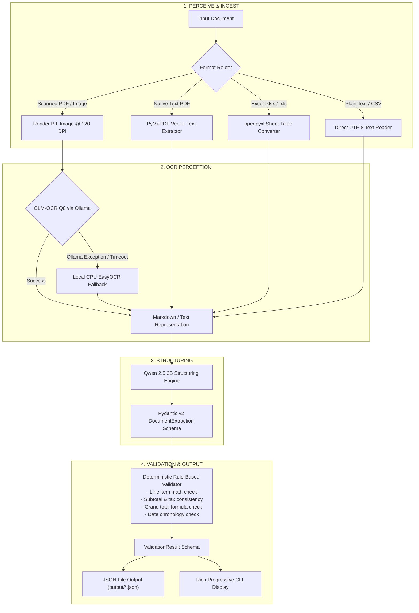

# Document Data Extractor Agent

> An intelligent, privacy-first **Perceive -> OCR -> Structure -> Validate** pipeline that extracts structured JSON from invoices, receipts, and purchase orders using local Ollama models with deterministic rule-based validation (zero cloud API dependencies).

---

## 30-Second Review

Reviewers can evaluate the end-to-end capabilities, schema fidelity, and validation behavior directly from this section without configuring local dependencies.

### 1. Inlined Worked Example: `Invoice_image.pdf`

Below is the verbatim extraction output from [`output/Invoice_image.json`](output/Invoice_image.json), generated from a scanned Indian corporate tax invoice ([`sample_documents/Invoice_image.pdf`](sample_documents/Invoice_image.pdf)):

```json
{
  "document_type": "invoice",
  "vendor_name": "Innovus Tech",
  "vendor_address": "67, Naviniman Society, Pratap Nagar, Nagpur, Maharashtra - 440022 India",
  "customer_name": "Nike Inc.",
  "customer_address": "Nike One Way, Hollywood Blv., Los Angeles, 110022 CA, USA",
  "document_id": "INV-2024-052",
  "date": "2024-09-14",
  "due_date": "2024-09-21",
  "line_items": [
    {
      "description": "Website Design",
      "quantity": 1.0,
      "unit_price": 50000.0,
      "total": 50000.0
    },
    {
      "description": "Website Development",
      "quantity": 1.0,
      "unit_price": 20000.0,
      "total": 20000.0
    },
    {
      "description": "UX Design",
      "quantity": 1.0,
      "unit_price": 20000.0,
      "total": 20000.0
    },
    {
      "description": "Website Copywriting",
      "quantity": 1.0,
      "unit_price": 10000.0,
      "total": 10000.0
    }
  ],
  "subtotal": 100000.0,
  "tax": 9000.0,
  "shipping": null,
  "discount": null,
  "total": 118000.0,
  "currency": "INR",
  "payment_method": "Cash",
  "notes": null,
  "validation": {
    "is_valid": false,
    "issues": [
      {
        "field": "total",
        "severity": "error",
        "message": "Grand total mismatch: Base (100000.00) + Tax (9000.00) + Shipping (0.00) - Discount (0.00) = 109000.00, but extracted total is 118000.00.",
        "expected": "109000.00",
        "actual": "118000.00"
      }
    ]
  }
}
```

#### Why the Validation Flagged This (And Why It Proves the System Works)
The scanned invoice contains an Indian GST split-tax breakdown: **Subtotal ₹100,000 + CGST (9%) ₹9,000 + SGST (9%) ₹9,000 = Grand Total ₹118,000**. The text structuring model extracted the first tax line (`tax: 9000.0`) but omitted the secondary SGST component. 

Rather than silently accepting this mismatch and passing corrupted financial data into an ERP system, the deterministic validation engine detected that $\text{Base (100,000.00)} + \text{Tax (9,000.00)} = 109,000.00 \neq 118,000.00$ and flagged the discrepancy in the output payload.

---

### 2. Multi-Document Test Results (All 6 Sample Documents)

The table below reflects the exact output from running `python main.py extract-all` across all documents in [`sample_documents/`](sample_documents/):

| Filename | Format | Document Type | Vendor | Total | Status | Issues | Distinct Layout & Perception Notes |
| :--- | :--- | :--- | :--- | :---: | :---: | :---: | :--- |
| [`blur_invoice.png`](sample_documents/blur_invoice.png) | PNG Image | `invoice` | Margarita Perez | USD 600.00 | `[PASS]` | 0 | Deliberately blurred/low-contrast scan; GLM-OCR perception resolved all 3 line items and matched the total. |
| [`groceryReceipt.txt`](sample_documents/groceryReceipt.txt) | Plain Text | `receipt` | FRESH MARKET GROCERY | USD 43.41 | `[PASS]` | 0 | Unstructured ASCII register text; direct text ingestion bypassed OCR, parsing 8 items with sales tax. |
| [`Invoice_image.pdf`](sample_documents/Invoice_image.pdf) | Scanned PDF | `invoice` | Innovus Tech | INR 118000.00 | `[ISSUES]` | 1 | Multi-tax Indian GST invoice; validator caught unmapped SGST tax component. |
| [`McDonalds_receipt.jpg`](sample_documents/McDonalds_receipt.jpg) | JPG Photo | `receipt` | McDonald's | CAD 5.99 | `[PASS]` | 0 | Fast-food photo receipt; extracted 2 line items, subtotal, tax, and order identifier. |
| [`purchase_order.xlsx`](sample_documents/purchase_order.xlsx) | Excel (.xlsx) | `purchase_order` | Jeff J Ritchie | 270.00 | `[PASS]` | 0 | Multi-column spreadsheet PO (PO-001); openpyxl converted non-empty rows into clean Markdown tables. |
| [`test_invoice_text_1.pdf`](sample_documents/test_invoice_text_1.pdf) | Vector PDF | `invoice` | - | USD 861.20 | `[PASS]` | 0 | Digital PDF with native text layer; PyMuPDF extracted text directly, structuring 9 hotel line items. |

- Raw JSON outputs are saved in [`output/`](output/):
  - [`output/blur_invoice.json`](output/blur_invoice.json)
  - [`output/groceryReceipt.json`](output/groceryReceipt.json)
  - [`output/Invoice_image.json`](output/Invoice_image.json)
  - [`output/McDonalds_receipt.json`](output/McDonalds_receipt.json)
  - [`output/purchase_order.json`](output/purchase_order.json)
  - [`output/test_invoice_text_1.json`](output/test_invoice_text_1.json)
- Full documentation on error isolation and failure cases: [`docs/validation_and_failures.md`](docs/validation_and_failures.md)

<!-- TODO: screenshot of summary table, insert here -->

---

## Why Fully Local / Zero Cloud API Keys

This system requires **no API keys, no account signups, and zero third-party cloud connections**. 

Financial documents such as vendor invoices, employee expense receipts, and purchase orders contain confidential data (banking details, addresses, tax IDs, and commercial pricing). Running 100% on-device via local Ollama inference ensures that sensitive documents never leave the local environment while eliminating recurring API processing costs.

---

## System Requirements

- **Operating System**: Windows 10/11, macOS, or Linux.
- **Python Version**: Python 3.10+ (tested on Python 3.11.5).
- **Ollama Engine**: Local Ollama server running at `http://localhost:11434`.
- **Local Model Weights**:
  - `glm-ocr:q8_0` (1.6 GB disk space)
  - `qwen2.5:3b` (1.9 GB disk space)
  - *Total model storage footprint*: ~3.5 GB.
- **Hardware**: 8 GB RAM minimum (runs comfortably on CPU). GPU acceleration is supported if available but not required.

---

## Installation & Running

### Step-by-Step Setup

1. **Verify Ollama is Installed and Running**:
   ```bash
   ollama --version
   ```
   *(If not installed, download from [ollama.com](https://ollama.com) and start the application).*

2. **Pull the Required Quantized Models**:
   ```bash
   ollama pull glm-ocr:q8_0
   ollama pull qwen2.5:3b
   ```

3. **Install Python Dependencies**:
   ```bash
   pip install -r requirements.txt
   ```

4. **Verify Environment Readiness**:
   ```bash
   python main.py check-connection
   ```

5. **Extract Data from a Single Document**:
   ```bash
   python main.py extract sample_documents/purchase_order.xlsx
   ```

6. **Batch Process All Sample Documents**:
   ```bash
   python main.py extract-all
   ```

### 1-Command Automated Launchers
- **Windows**: Run [`run.bat`](run.bat)
- **Linux / macOS**: Run `bash run.sh`

### Inspecting Output JSON
All extraction results are saved to the `output/` folder. You can format and inspect them directly in your terminal:
```bash
python -m json.tool output/purchase_order.json
```

<!-- TODO: screenshot of terminal extraction output, insert here -->

---

## Architecture



---

## Design Decisions & Tradeoffs

1. **Two-Stage Specialized Architecture (`glm-ocr:q8_0` + `qwen2.5:3b`)**:
   - Document OCR and JSON structuring require distinct capabilities. `glm-ocr:q8_0` (0.9B) is specialized for visual layout comprehension and OCR table transcription, while `qwen2.5:3b` (3B) is trained on structured text-to-JSON schema mapping.
   - Splitting perception and structuring into two compact models allows the pipeline to run on commodity CPU hardware (~3.5 GB model weights) without requiring a heavy 8B+ vision-language model.

2. **Explicit Context Window Configuration (`num_ctx: 10240`)**:
   - In [`src/ocr_client.py`](src/ocr_client.py), `num_ctx` is explicitly set to `10240`. Ollama's default context of `4096` causes visual token truncation on dense, full-page invoices.

3. **Fault-Tolerant EasyOCR Fallback**:
   - In [`src/ocr_client.py`](src/ocr_client.py), if Ollama encounters a network timeout, socket disconnect, or server error, the client catches the exception and immediately invokes a local EasyOCR reader on CPU to prevent crashing the batch.

4. **Excel Spreadsheet Ingestion (`openpyxl`)**:
   - In [`src/document_loader.py`](src/document_loader.py), `_load_excel_as_markdown` iterates through worksheet cells and filters out empty formula columns and blank rows before generating Markdown tables. This prevents prompt token bloat on template spreadsheets with hundreds of empty cells.

5. **Deterministic Rule-Based Validation**:
   - In [`src/validator.py`](src/validator.py), all financial arithmetic, tax reconciliation, and date logic checks are implemented in pure Python. Relying on an LLM to "self-validate" its own math introduces hallucination risk; deterministic code guarantees reproducible audit trails.

6. **Null-Safe Line Item Arithmetic**:
   - Retail receipts often omit per-item unit prices and quantities (e.g. coffee listed simply as `$4.50`). The line item validator only triggers quantity $\times$ unit price checks when both fields are explicitly present, avoiding false-positive errors on receipts.

---

## Limitations & Known Failure Cases

1. **Small Structuring Model Capacity (`qwen2.5:3b`)**:
   - `qwen2.5:3b` is optimized for speed and low memory footprint on local hardware. While `glm-ocr` reliably transcribes complex visual layouts, the 3B model can occasionally miss fields or drop secondary table rows on highly unconventional layouts.
2. **Multi-Table Invoice Boundaries**:
   - Invoices containing multiple separate item tables (e.g. materials vs. labor) are transcribed accurately by OCR, but the structuring prompt currently aggregates them into a single linear list.
3. **Collapsing Split Tax Components**:
   - As demonstrated in `Invoice_image.pdf`, invoices with split tax lines (e.g. Indian CGST 9% + SGST 9%) may have only one component mapped to the scalar `tax` field by the model, which is then flagged by the validation engine.
4. **Execution Throughput on CPU**:
   - Single-threaded local inference on CPU takes between **24s and 108s per document** (totaling ~6.3 minutes for the 6 sample documents). Processing a batch of 50 documents on CPU would take approximately 45–60 minutes.
5. **Language and Quality Constraints**:
   - `glm-ocr` is optimized for English and Chinese printed text; handwritten annotations and degraded low-DPI scans can cause optical character confusion.
   - For full analysis of error handling, see [`docs/validation_and_failures.md`](docs/validation_and_failures.md).

---

## Future Improvements

> *Note: The items below are not currently implemented and are documented as scoped future architectural enhancements.*

- **Pipelined / Overlapped Asynchronous Execution**:
  - Because `glm-ocr:q8_0` (1.6 GB) and `qwen2.5:3b` (1.9 GB) fit concurrently within system memory, the agent could overlap execution (running OCR on document $N+1$ in a background thread while structuring document $N$).
- **Multi-Tax Component Schema Extension**:
  - Extending the Pydantic schema from a scalar `tax: float` to a structured `taxes: list[TaxComponent]` (e.g. CGST, SGST, VAT, State, Federal) to represent split-tax jurisdictions.
- **Dynamic Few-Shot Prompt Routing**:
  - Dynamically injecting few-shot layout examples into the structuring prompt based on the detected document domain (hospitality, logistics, retail, legal).

---

## Testing

The project includes an automated test suite verifying document ingestion, HTML table preprocessing, mathematical sanity checks, discount/shipping arithmetic, and date chronology.

### Running Unit Tests

```bash
python -m pytest tests/
```

### Actual Test Suite Output

```
============================= test session starts =============================
platform win32 -- Python 3.11.5, pytest-7.1.2, pluggy-1.6.0
rootdir: C:\Users\adity\Document_Data_Extraction
plugins: anyio-4.13.0
collected 8 items

tests\test_pipeline.py ........                                          [100%]

============================== 8 passed in 0.67s ==============================
```

---

## Repository Structure

```
Document_Data_Extraction/
├── README.md                          # Project documentation & 30-second review
├── requirements.txt                   # Production dependencies
├── main.py                            # CLI entry point (extract, extract-all, check-connection)
├── run.bat                            # 1-click Windows runner
├── run.sh                             # 1-click Linux/macOS runner
├── docs/
│   └── validation_and_failures.md     # In-depth validation rules & failure case analysis
├── src/
│   ├── __init__.py
│   ├── agent.py                       # Pipeline orchestrator & stage latency telemetry
│   ├── document_loader.py             # Multi-format ingestion (PDF, Image, Excel, Text)
│   ├── ocr_client.py                  # GLM-OCR Q8 Ollama client with EasyOCR fallback
│   ├── structure_client.py            # Qwen 2.5 3B JSON structuring client & HTML cleaner
│   ├── validator.py                   # Pure Python deterministic financial validation rules
│   └── schemas.py                     # Pydantic v2 data models & validation schemas
├── tests/
│   ├── __init__.py
│   └── test_pipeline.py               # Automated pytest suite (8 test cases)
├── sample_documents/                  # 6 distinct real-world test documents
│   ├── blur_invoice.png               # Degraded low-contrast image invoice
│   ├── groceryReceipt.txt             # Unstructured ASCII retail receipt
│   ├── Invoice_image.pdf              # Scanned multi-tax Indian GST invoice
│   ├── McDonalds_receipt.jpg          # Fast-food photo receipt
│   ├── purchase_order.xlsx            # Multi-column Excel purchase order
│   └── test_invoice_text_1.pdf        # Vector PDF invoice with native text layer
└── output/                            # Validated JSON extractions
    ├── blur_invoice.json
    ├── groceryReceipt.json
    ├── Invoice_image.json
    ├── McDonalds_receipt.json
    ├── purchase_order.json
    └── test_invoice_text_1.json
```
