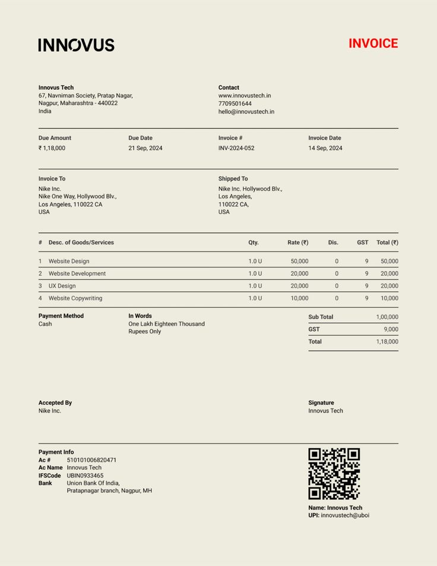
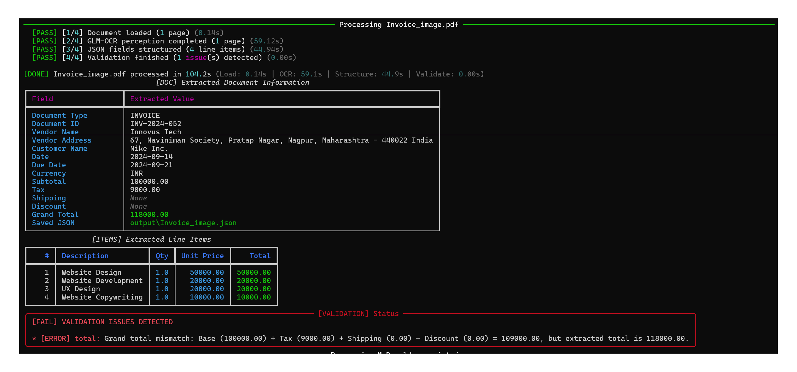

# Case Study: Detecting an Invoice Total Mismatch

## Overview

This case study shows how the validation layer detects an arithmetic inconsistency in `Invoice_image.pdf`. The invoice lists a subtotal of **INR 100,000**, a single GST amount of **INR 9,000**, and a grand total of **INR 118,000**.

Using the figures printed on the document, the grand total does not add up. The system correctly flags this discrepancy instead of accepting the total without verification.

## The source invoice

The invoice contains four line items that total INR 100,000. Its tax section shows only one field:

```text
GST: INR 9,000
```

The stated grand total is INR 118,000.



## What the validation layer found

The extraction pipeline read the subtotal, GST amount, and grand total from the invoice. It then checked whether the total reconciled with the extracted values:

```text
Subtotal       INR 100,000
GST shown      INR   9,000
Shipping       INR       0
Discount       INR       0
Expected total INR 109,000

Grand total on invoice INR 118,000
Difference             INR   9,000
```

Because INR 100,000 plus the only printed GST value of INR 9,000 equals INR 109,000, not INR 118,000, the validator reports a mismatch on the `total` field.



## Why the invoice is inconsistent

The invoice does **not** list separate CGST and SGST amounts. It presents only one GST field for INR 9,000, so the printed calculation is incomplete:

```text
INR 100,000 + INR 9,000 GST = INR 109,000
```

The displayed grand total of INR 118,000 would be correct only if there were two INR 9,000 tax components:

```text
INR 100,000 + INR 9,000 CGST + INR 9,000 SGST = INR 118,000
```

However, those two components are not represented on the invoice. As written, the invoice has a calculation or presentation error, and the system is right to flag it.

## System limitation: it cannot infer missing GST components

A person familiar with India's GST system may recognise that the INR 9,000 amount is likely one half of a combined 18% GST charge: INR 9,000 CGST plus INR 9,000 SGST. That interpretation explains why the invoice total is INR 118,000.

The system validates the data that is actually present. It cannot safely assume that an unlabelled GST value should be doubled, because the invoice does not state a second tax component. Automatically inferring a missing INR 9,000 amount could conceal a genuine invoice error or create an incorrect record for invoices that use a different tax structure.

This is an important limitation: the system can identify that the extracted values do not reconcile, but it cannot apply domain knowledge to repair an incomplete invoice. A GST-aware human reviewer is needed to determine whether the document omitted the CGST and SGST split or whether the total itself is wrong.

## Outcome

The validation result is successful because it prevents an inconsistent financial record from being treated as correct. The case also shows where human tax knowledge adds value: a reviewer can recognise the likely missing GST split, investigate the source document, and correct or request clarification before using the data downstream.
